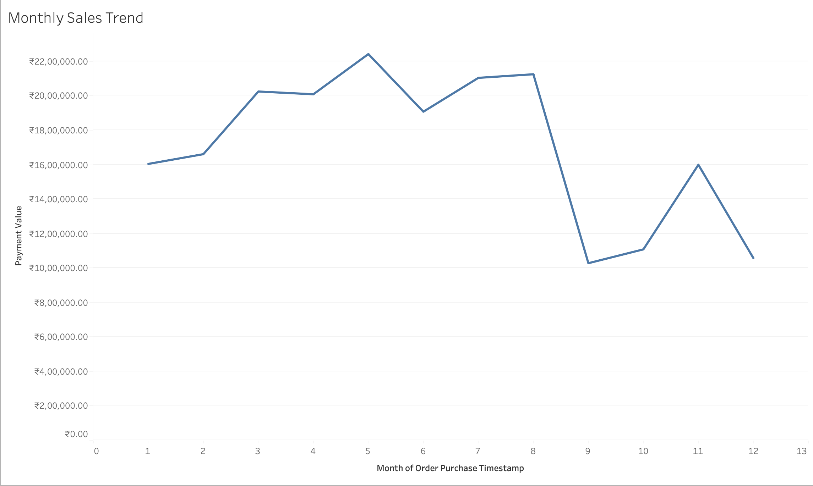
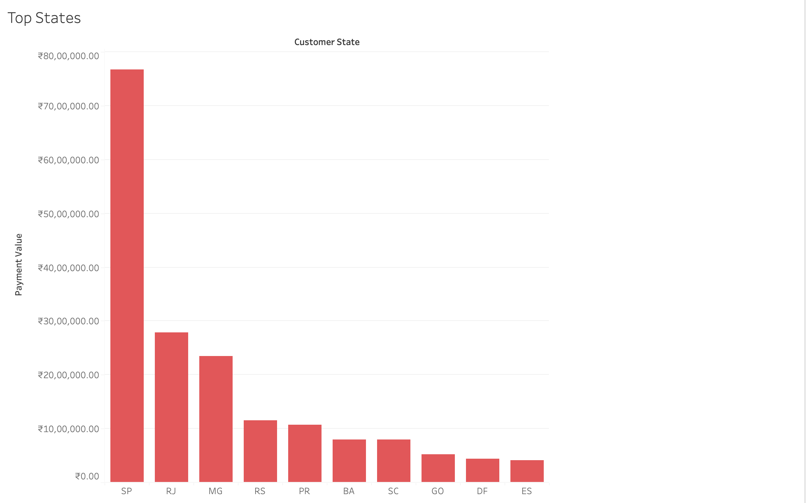
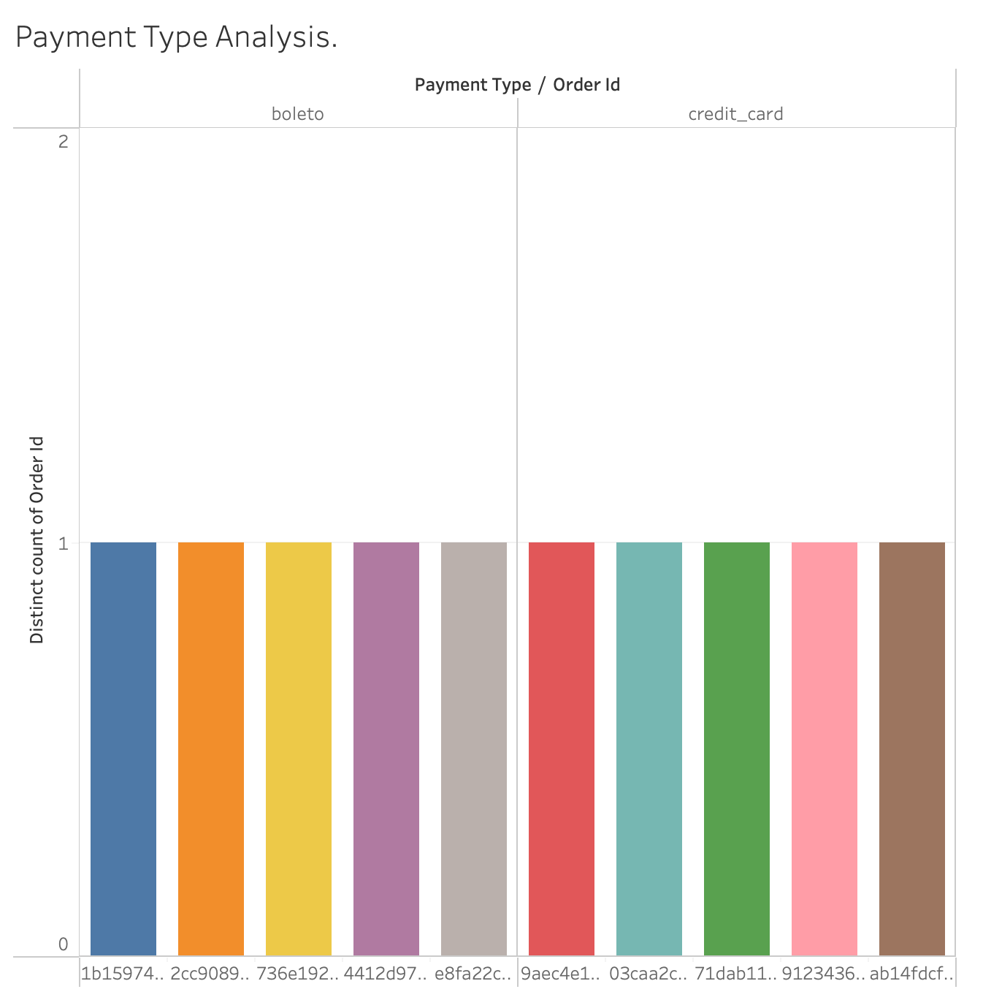
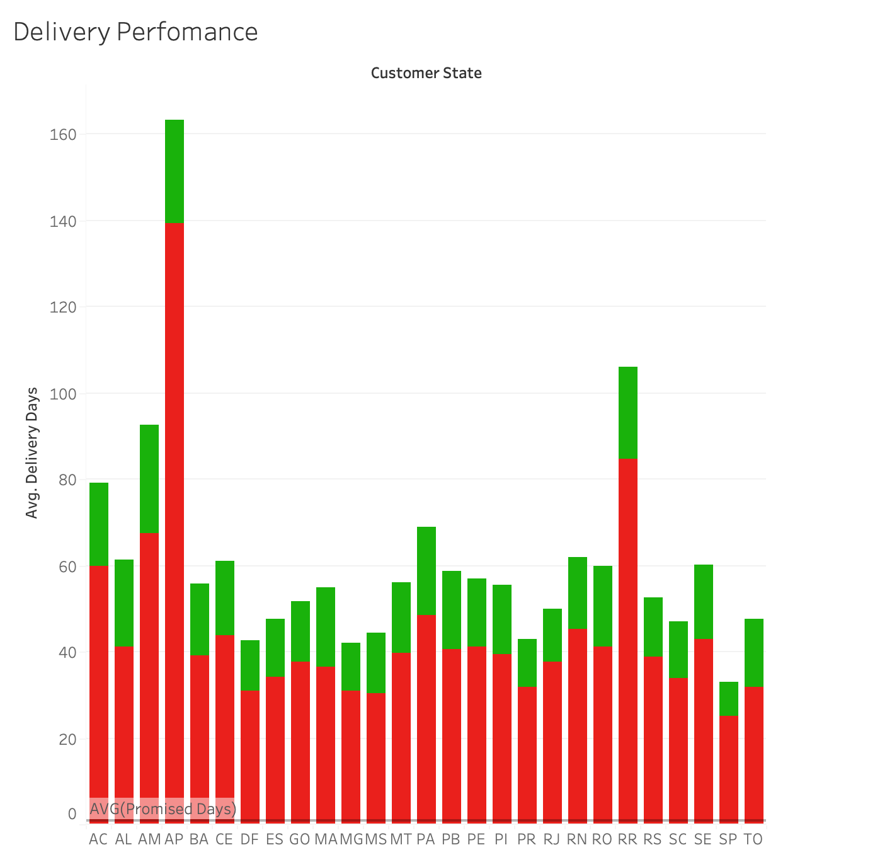
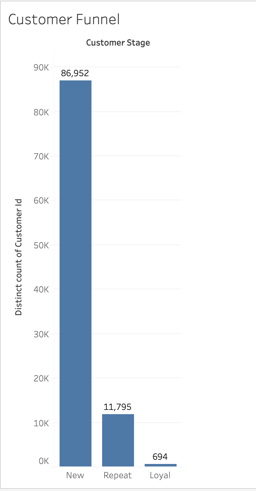
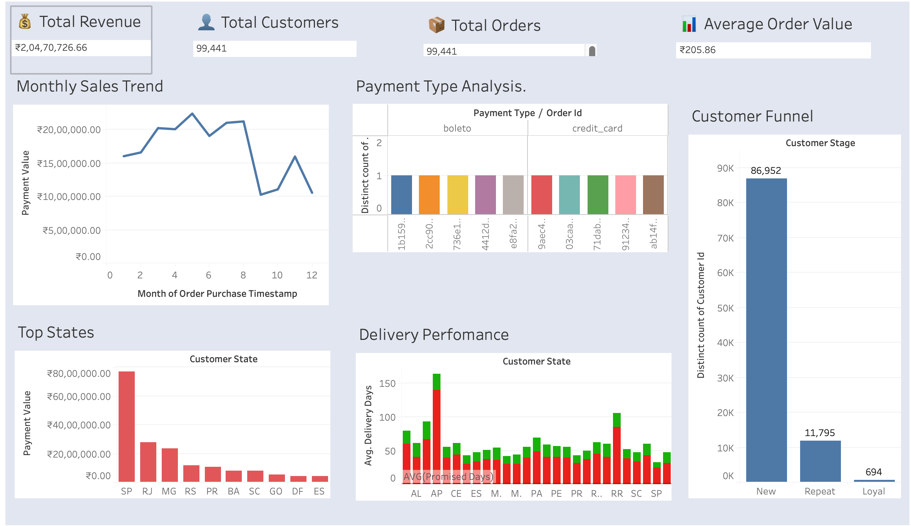

# E-Commerce-Analysis
# Interactive Tableau dashboard analyzing sales, customer behavior, and delivery performance for the Olist dataset.

## Overview
This dashboard provides insights into key e-commerce metrics including revenue trends, top performing regions, customer payment preferences, delivery performance, and customer retention. Designed to showcase data analysis and visualization skills.

## Key Visuals

### KPI Cards
- Total Revenue 💰  
- Total Orders 📦  
- Total Customers 👤  
- Average Order Value 📊  

### Sales Trend
- Revenue over time with forecast to identify growth and seasonality.

### Top 5 States by Revenue
- Bar chart showing top performing states.

### Payment Type Analysis
- Number of orders per payment method.

### Delivery Performance
- Average delivery days vs promised delivery.  
- Percentage of late deliveries highlighted.

### Customer Growth Funnel
- Shows new, repeat, and loyal customers.

### Dash-Board 

## Skills Demonstrated
- Tableau Desktop: Dashboard creation, calculated fields, filters, KPI cards  
- Data Analysis: Revenue trends, customer segmentation, delivery performance  
- Data Visualization Best Practices: Clear, interactive, and actionable insights  

## Repository Contents
- `Olist_Dashboard.twbx` – Tableau workbook file  
- Screenshots of all key visuals  

---
